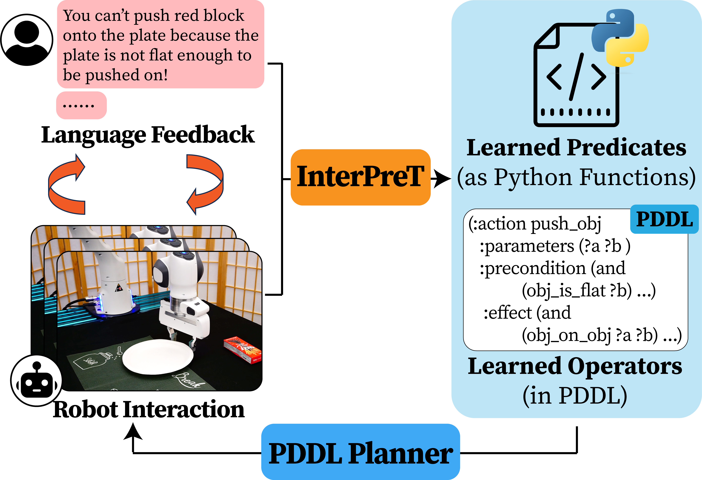

# Interactive Predicate Learning for Robot Planning

<p align="center">
  
</p>

This repo contains the simulation code of our RSS 2024 paper [InterPreT: Interactive Predicate Learning from Language Feedback for Generalizable Task Planning](https://arxiv.org/abs/2405.19758).

InterPreT is a LLM-powered framework that learns PDDL domains (symbolic predicates and operators) from language feedback for long-horizon, generalizable robot task planning.

## Installation

### Configure conda dependencies

We use [Anaconda](https://www.anaconda.com/) as the default way to configure dependency.

Clone the repo, and configure conda environment with dependencies

```bash
cd $your_workspace
git clone https://github.com/hmz-15/Interactive-Predicate-Learning.git

cd Interactive-Predicate-Learning
conda env create -f environment.yml
```

Before running any scripts below, always remember to activate the conda env first.

```bash
conda activate interactive_predicate_learning
```

### Install PDDL planners

Mke sure you have cmake installed first. You can install it with

```bash
sudo apt-get install cmake
```

Clone and build pddlgym_planners

```bash
cd $your_workspace/Interactive-Predicate-Learning
conda activate interactive_predicate_learning

git clone https://github.com/hmz-15/pddlgym_planners.git
cd pddlgym_planners
pip install -e .
cd ..
```

Fast Downward planner will build the first time it is imported.

### OpenAI GPT-4 API Keys

Create a folder named `openai_keys` under the project directory, and create a file named `openai_key.json` under the folder. Fill the json file with:

```bash
{
    "key": "xxx",
    "org": "xxx",
    "proxy" : "xxx"
}
```

The `org` and `proxy` fields are optional.

## Usage

This repo adopts a unified way to run all the training and testing scripts. It uses a single `main.py` file under `predicate_learning`, while the configs are managed with [hydra-core](https://hydra.cc/docs/intro/).

The `main.py` script takes a few core arguments:

- `world`: the name of environment, choose from `StoreObjects`, `SetTable`, `CookMeal`
- `mode`: running mode, `train` or `test`. Different modes correspond to diferent tasks. The tasks are loaded from json files in `predicate_learning/predicate_gym/domains/$world/$mode`; these json files are generated from `predicate_learning/configs/world`
- `agent`: the name of agent that learns and solves the tasks
- `render`: (optional) whether to visualize and save key frames, default to true
- `save_dir`: (optional) dir to save results, default to `saved_runs/run_${mode}/${now:%Y-%m-%d-%H-%M-%S}/$world_$agent`

### Quickstart

Before running InterPreT, you can see how the domains and tasks are like using simple agents:

- `RandomPlanAgent`: agent that plan random actions
- `OraclePlanAgent`: agent that use ground truth PDDL to plan optimal actions

```bash
python -m predicate_learning.main --config-name=run_single_mode mode=test world=StoreObjects render=true agent=OraclePlanAgent
```

Feel free to try different `world`, `mode`, and `agent`. Delay expected to build PDDL planners the first time you run `OraclePlanAgent`.

### Learn predicates & operators with InterPreT

InterPreT is implemented as `LearnPDDLAgent`. It is the only agent that requires a training phase to learn knowledge. Other LLM-based agents directly learn from few-shot planning examples.

```bash
python -m predicate_learning.main --config-name=run_single_mode mode=train world=StoreObjects render=true agent=LearnPDDLAgent
```

Optionally, you can warm-up learning with predicates learned in other domains:

- Set `load_agent_knowledge` to true
- Set `agent.load_path` to the directory of saved run

### Run test with InterPreT

To run test with InterPreT, we need to load learned predicates and operators from training runs. We provide example saved training runs for all three domains in `interpret_results/`.

```bash
python -m predicate_learning.main --config-name=run_single_mode mode=test world=StoreObjects agent=LearnPDDLAgent render=true agent.load_path=interpret_results/StoreObjects_LearnPDDLAgent
```

- `agent.load_path`: you can change to your saved training run

### Run test with other baseline agents

#### [Inner Monologue](https://innermonologue.github.io/) + Object

```bash
python -m predicate_learning.main --config-name=run_single_mode mode=test world=StoreObjects agent=LLMPlanAgent render=true agent.use_learned_predicates=false agent.use_few_shot_demos=true
```

#### [Inner Monologue](https://innermonologue.github.io/) + Object + Scene (use predicates learned with InterPreT)

```bash
python -m predicate_learning.main --config-name=run_single_mode mode=test world=StoreObjects agent=LLMPlanAgent render=true agent.load_path=interpret_results/StoreObjects_LearnPDDLAgent agent.use_few_shot_demos=true agent.use_both_text_and_predicates=true
```

- `agent.load_path`: you can change to your saved training run

#### [Inner Monologue](https://innermonologue.github.io/) + Object + Scene + Precond (use predicates learned with InterPreT)

```bash
python -m predicate_learning.main --config-name=run_single_mode mode=test world=StoreObjects agent=LLMPlanPrecondAgent render=true agent.load_path=interpret_results/StoreObjects_LearnPDDLAgent agent.use_few_shot_demos=true agent.use_both_text_and_predicates=true
```

- `agent.load_path`: you can change to your saved training run

#### [Code as Policies](https://code-as-policies.github.io/)

```bash
python -m predicate_learning.main --config-name=run_single_mode_cap mode=test world=StoreObjects agent=CaPAgent render=true
```
